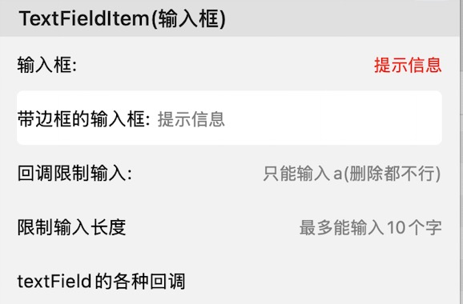

## Item Usage

For convenience, some common properties are defined in the base class:
> **backgroundColor**: Cell background color
>
> **contentBgColor**: ContentView background color
>
> **contentInsets**: Content margins (theoretically should be the margin from contentView to Cell, only for storage, the base class doesn't adjust based on this property, subclasses can adjust layout as needed)
>
> **isDisabled**: Whether non-interactive, defaults to false. When set to true, cell click events will not be triggered
>
> **isHidden**: Whether hidden, defaults to false
>
> **isSelectable**: Whether selectable, defaults to true. When set to false, the cell's onSelectedChanged method will not be triggered, and Form's selectedItemDecoration will not mark the Item
>
> **isSelected**: Whether already selected (can set some styles based on selection state in update)
>
> **scrollToSelected**: Whether to scroll to item position when selected

And some callback methods (Callbacks):
> **onValueChanged()**: Called when the item's `value` changes. When customizing Items, it can be triggered through `callbackOnDataChange()`
> **onCellSelection()**: Called when user clicks the item and it gets selected.
> **onCellUpdate()**: Called when cellForItemAt delegate method is called and cell is obtained.
> **onCellHighlightChanged()**: Callback when highlight state changes. The item's isHighlighted property can be used in the callback to get highlight state

There are also some commonly used methods and properties:
> **section**: The Section where the Item belongs
> **cell**: The cell corresponding to the Item (may be empty)
> **indexPath**: Get the position of the item in the form
> **isShow**: Whether currently displayed
> **updateLayout(animation:)**: Refresh interface layout

--- 

## Built-in Item Introduction

The following are predefined cells that can be used directly in each module:

#### Base
|     Name      |                             Description                             |                       Screenshot                        |                          Documentation                         |
| :-----------: | :----------------------------------------------------------: | :-------------------------------------------------: | :--------------------------------------------------: |
|   CustomViewItem   | Container for quickly wrapping existing Views into Items |              Display existing View content                |           [CustomViewItem](./CustomViewItem.md)            |
|   EmptyItem   | Predefined blank placeholder item |                As placeholder item, no screenshot                |           [EmptyItem](./EmptyItem.md)            |
|   LineItem   | Predefined separator line Item with customizable line width, corner radius, content margins, line color and background color |                    |           [LineItem](./LineItem.md)            |

#### Items

|     Name      |                             Description                             |                       Screenshot                        |                          Documentation                         |
| :-----------: | :----------------------------------------------------------: | :-------------------------------------------------: | :--------------------------------------------------: |
|   TitleValueItem   | Text display cell Can display title and value, with customizable title, value styles and positions |                                 |           [TitleValueItem](./TitleValueItem.md)            |
|  SwitchItem   | Cell with switch control, can display title and switch, with customizable title, switch styles and positions |                             |     [SwitchItem](./SwitchItem.md)      |
|  ButtonItem   | Button cell (entire cell is a button), can perform any operation when clicked (such as jumping to new interface) |                                |     [ButtonItem](./ButtonItem.md)      |
| TextFieldItem | Cell with textfield, can display title and input field, with customizable title, input field styles |  | [TextFieldItem](./TextFieldItem.md) |
| TextViewItem  | Cell with textview input field, can display left title and right input field, with customizable title, input field styles, auto-adjusting height |                          |        [TextViewItem](./TextViewItem.md)         |
| HtmlInfoItem  | Cell with webview for displaying html code, automatically adjusts final display size based on webpage content size and user settings |                          |        [HtmlInfoItem](./HtmlInfoItem.md)         |

#### WebImage
|     Name      |                             Description                             |                       Screenshot                        |                          Documentation                         |
| :-----------: | :----------------------------------------------------------: | :-------------------------------------------------: | :--------------------------------------------------: |
|   ImageItem   | Image display cell with customizable image aspect ratio, content margins, corner radius, etc., supports network image loading |                              |       [ImageItem](./ImageItem.md)       |
## Custom Item

For methods to customize cells, refer to: [How to Customize Item](./如何自定义Item.md)