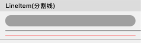
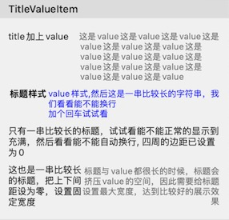
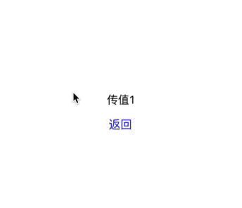

## Item的使用

为了方便使用，基类中定义了一些通用属性：
> **backgroundColor**：cell背景色
>
> **contentBgColor**：contentView背景色
>
> **contentInsets**：内容边距（理论上应为contentView到Cell的边距，仅作为存储用，基类中未根据此属性调整，子类中可按需自行调整布局）
>
> **isDisabled**：是否不可交互，默认为false，设置为true后，cell的点击事件将不会触发
>
> **isHidden**：是否隐藏，默认为false
>
> **isSelectable**：是否可选中，默认为true，设置为false后，cell的onSelectedChanged方法将不会被触发，Form的selectedItemDecoration也不会标记Item
>
> **isSelected**：是否已被选中（可在update中根据选中状态进行一些样式设置）
>
> **scrollToSelected**：选中时是否滚动到item位置

以及一些回调方法(Callbacks)：
> **onValueChanged()**：当item的`value`改变时调用。自定义Item时，可以通过`callbackOnDataChange()`来触发
> **onCellSelection()**：当用户点击item并且被选中的时候调用。
> **onCellUpdate()**：cellForItemAt代理方法被调用并获取到cell时调用。
> **onCellHighlightChanged()**：高亮状态改变时的回调，回调中可使用item的isHighlighted属性获取是否高亮状态

还有一些比较常用的方法和属性：
> **section**：Item所在的Section
> **cell**：Item所对应的cell（可能为空）
> **indexPath**：获取item在form中的位置
> **isShow**：是否正在展示
> **updateLayout(animation:)**：刷新界面布局

--- 

## 内置的Item介绍

以下为各模块中预定义好可直接使用的单元格：

#### Base
|     名称      |                             说明                             |                       效果图                        |                         文档                         |
| :-----------: | :----------------------------------------------------------: | :-------------------------------------------------: | :--------------------------------------------------: |
|   CustomViewItem   | 用于将已有的View快速包装成Item的容器 |              展示已有的View的内容                |           [CustomViewItem](./CustomViewItem_CN.md)            |
|   EmptyItem   | 定义好的空白占位item |                作为占位item，无效果图                |           [EmptyItem](./EmptyItem_CN.md)            |
|   LineItem   | 定义好的分割线Item，可自定义线的宽度、圆角、内容边距、线的颜色以及背景色 |                    |           [LineItem](./LineItem_CN.md)            |

#### Items

|     名称      |                             说明                             |                       效果图                        |                         文档                         |
| :-----------: | :----------------------------------------------------------: | :-------------------------------------------------: | :--------------------------------------------------: |
|   TitleValueItem   | 文字展示单元格 可展示标题和value，同时提供自定义标题、value样式和位置等属性 |                                 |           [TitleValueItem](./TitleValueItem_CN.md)            |
|  SwitchItem   | 带switch控件的单元格，可展示标题和switch，同时提供自定义标题、switch样式和位置等属性 |                             |     [SwitchItem](./SwitchItem_CN.md)      |
|  ButtonItem   | 按钮单元格（整个单元格为一个按钮），点击可以任意操作（如点击跳转到新的界面） |                                |     [ButtonItem](./ButtonItem_CN.md)      |
| TextFieldItem | 带textfield的单元格，可展示标题和输入框，同时提供自定义标题、输入框样式等属性 |  | [TextFieldItem](./TextFieldItem_CN.md) |
| TextViewItem  | 带textview输入框单元格，可展示左侧标题和右侧的输入框，同时提供自定义标题、输入框样式，自动调整高度 |                          |        [TextViewItem](./TextViewItem_CN.md)         |
| HtmlInfoItem  | 带webview的单元格，用于展示html代码，会根据网页内容大小和用户设置自动调整最终展示大小 |                          |        [HtmlInfoItem](./HtmlInfoItem_CN.md)         |

#### WebImage
|     名称      |                             说明                             |                       效果图                        |                         文档                         |
| :-----------: | :----------------------------------------------------------: | :-------------------------------------------------: | :--------------------------------------------------: |
|   ImageItem   | 图片展示单元格，可设置图片预估比例、内容边距、圆角等，支持网络图片加载 |                              |       [ImageItem](./ImageItem_CN.md)       |
## 自定义Item

自定义单元格的方法参考这里: [如何自定义Item](./如何自定义Item_CN.md)
