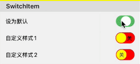

# SwitchItem

Cell with switch control, can display title and switch, with customizable title, switch styles and positions



## Properties 

### Overall Settings (Base class properties not listed)

> **verticalAlignment**: Vertical arrangement method

### Title Style

> **title**: Title content text
>
> **titlePosition**: Position (auto width/fixed width)
>
> **titleFont**: Font
>
> **titleColor**: Font color
>
> **titleLines**: Number of lines
>
> **titleAlignment**: Alignment
>
> **attributeTitle**: Rich text title, if set, will replace title to display this

### Right Switch Style

>**value**: Switch control on/off state, defaults to false
>
>**switchOffBackgroundColor**: Switch background color in off state
>**switchOnBackgroundColor**: Switch background color in on state
>
>**switchOffIndicatorColor**: Slider color in off state
>**switchOnIndicatorColor**: Slider color in on state
>
>**switchOffIndicatorText**: Text display added to slider in off state (recommend single character)
>**switchOnIndicatorText**: Text display added to slider in on state (recommend single character)
>
>**switchOffText**: Text displayed in background in off state
>**switchOnText**: Text displayed in background in on state
>
>**minimumSwitchSize**: Minimum size of switch (will expand if content text size exceeds)
>**switchContentInsets**: Switch internal spacing


## Usage Example

***Not recommended*** to add SwitchItem to horizontally scrolling CollectionView

```
Section("SwitchItem") { section in
    section.lineSpace = 0
    section.column = 1
}
    <<< SwitchItem("Set as default") { item in
        item.contentInsets = UIEdgeInsets(top: 10, left: 15, bottom: 5, right: 15)
        item.value = true
    }.onValueChanged({ (item) in
        /// Value change callback
        guard let labelItem = item.form?.firstItem(for: "DEFAULT_LABEL") as? LabelItem else {
            return
        }
        if item.value {
            labelItem.titlePosition = .width(200)
            labelItem.value = "Set as default"
        } else {
            labelItem.titlePosition = .left
            labelItem.title = "Value cleared, can change to auto width, entire row can display title value"
            labelItem.value = ""
        }
        labelItem.updateCell()
    })
    <<< SwitchItem("Custom style 1") { item in
        item.contentInsets = UIEdgeInsets(top: 5, left: 15, bottom: 5, right: 15)
        item.switchOffBackgroundColor = .red
        item.switchOnBackgroundColor = .blue
        item.switchOffIndicatorColor = .yellow
        item.switchOnIndicatorColor = .orange
        item.switchOffText = "Off"
        item.switchOnText = "On"
        item.switchOffIndicatorTextColor = .darkGray
        item.switchOnIndicatorTextColor = .white
    }
    <<< SwitchItem("Custom style 2") { item in
        item.contentInsets = UIEdgeInsets(top: 5, left: 15, bottom: 10, right: 15)
        item.switchOffBackgroundColor = .red
        item.switchOnBackgroundColor = .blue
        item.switchOffIndicatorColor = .yellow
        item.switchOnIndicatorColor = .orange
        item.switchOffIndicatorText = "Off"
        item.switchOnIndicatorText = "On"
        item.switchOffIndicatorTextColor = .darkGray
        item.switchOnIndicatorTextColor = .white
    }
```


