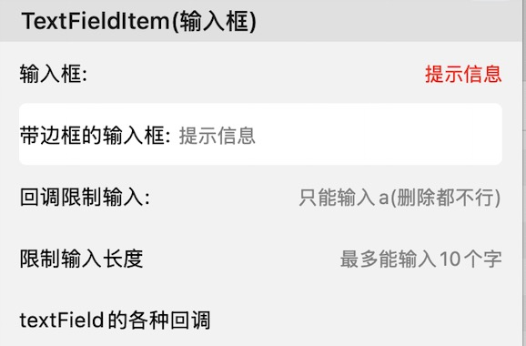

# TextFieldItem

带textfield的单元格，可展示标题和输入框，同时提供自定义标题、输入框样式等属性



## 属性

### 最外层Box

> **aspectHeight**：固定高度
>
> **boxInsets**：box到cell的边距
>
> **boxPadding**：内容部分到box的边距
>
> **boxBackgroundColor**：box的背景色
>
> **boxBorderWidth**：box的边框宽度
>
> **boxHighlightBorderWidth**：编辑时box的边框宽度
>
> **boxBorderColor**：box的边框颜色
>
> **boxHighlightBorderColor**：编辑时box的边框颜色
>
> **boxCornerRadius**：box的边框圆角

### 左侧title

> **title**：row的title将会设置为左侧的title显示
>
> **titlePosition**：位置，TitlePosition类型，包括`.left`（居左自动宽度）和`.width(:)`（指定宽度）两种样式
>
> **titleFont**：字体
>
> **titleTextColor**：颜色
>
> **titleLines**：行数
>
> **titleAlignment**：对齐方式
>
> **attributeTitle**：富文本标题，如果设置了，则会替换掉title显示这个

### 输入框

> **inputSpaceToTitle**：和title的间距
>
> **inputFont**：字体
>
> **inputTextColor**：颜色
>
> **inputAlignment**：对齐方式
>
> **keyboardType**：键盘样式
>
> **returnKeyType**：键盘确定按钮样式
>
> **placeHolder**：提示文字
>
> **placeHolderColor**：提示文字颜色
>
> **inputPredicateFormat**：输入内容正则校验表达式，PredicateFormat中定义了常用的几个表达式，如纯数字、小数位数限制等，可以参考
>
> **limitWords**：输入字数限制

### 输入框事件监听回调

> **onTextShouldChange()**：是否可以输入
>
> **onTextDidChanged()**：输入框的值改变
>
> **onTextFieldDidBeginEditing()**：开始编辑
>
> **onTextFieldDidEndEditing()**：结束编辑
>
> **onTextFieldShouldReturn()**：是否可以return
>
> **onTextFieldShouldClear()**：是否可以清空

## 使用举例

***不建议***将TextFildItem添加到横向滚动的CollectionView中

```
Section("TextFieldItem(输入框)") { section in
    section.lineSpace = 0
    section.column = 1
}
    <<< TextFieldItem("输入框:") { row in
        row.placeHolder = "提示信息"
        row.placeHolderColor = .red
        row.aspectRatio = CGSize(width: 375, height: 50)
    }
    <<< TextFieldItem("带边框的输入框:") { row in
        row.boxInsets = UIEdgeInsets(top: 0, left: 15, bottom: 0, right: 15)
        row.alignmentOfTextField = .left
        row.placeHolder = "提示信息"
        row.boxBorderWidth = 1.0
        row.boxBorderColor = .green
        row.boxHighlightBorderColor = .blue
        row.forgroundColor = .white
        row.boxCornerRadius = 5
        row.aspectRatio = CGSize(width: 375, height: 50)
    }
    <<< TextFieldItem("正则限制输入:") { row in
        row.placeHolder = "限制输入两位小数"
        row.inputPredicateFormat = PredicateFormat.decimal2.rawValue
    }
    <<< TextFieldItem("回调限制输入:") { row in
        row.placeHolder = "只能输入a(删除都不行)"
        row.onTextShouldChange({ (row, textField, range, string) -> Bool in
            return string == "a"
        })
    }
    <<< TextFieldItem("限制输入长度") { row in
        row.placeHolder = "最多能输入10个字"
        row.limitWords = 10
    }
    <<< TextFieldItem("textField的各种回调") { row in
        row.onTextDidChanged { (r, textField) in
            print("输入值改变:\(textField.text ?? "")")
        }
        row.onTextFieldShouldReturn { (r, t) -> Bool in
            /// 是否可以return
            r.cell?.endEditing(true)
            return true
        }
        row.onTextFieldShouldClearBlock { (r, t) -> Bool in
            /// 是否可以清空
            return true
        }
        row.onTextFieldDidEndEditing { (r, t) in
            print("编辑完成")
        }
        row.onTextFieldDidBeginEditing { (r, t) in
            print("开始编辑")
        }
    }
```

