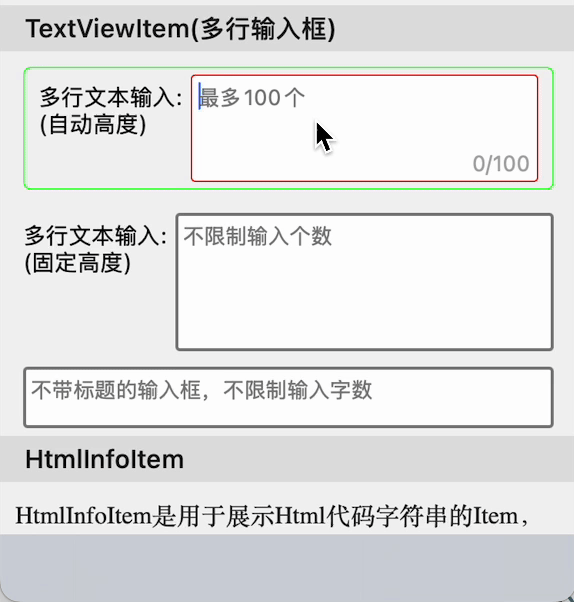

# TextViewItem

添加了textview输入框的多行输入单元格，可展示左侧标题和右侧的输入框，同时提供自定义标题、输入框样式，自动调整高度



## 属性

### 高度

> **minHeight**：最小高度
>
> **autoHeight**：是否自动高度，默认为true

### 最外层Box

> **boxInsets**：box到cell的边距
>
> **boxPadding**：内容部分到box的边距
>
> **boxBackgroundColor**：box的背景色
>
> **boxBorderWidth**：box的边框宽度
>
> **boxBorderColor**：box的边框颜色
>
> **boxCornerRadius**：box的边框圆角
>
> **boxEditingBorderColor**：编辑时box的边框颜色
>
> **boxEditingBorderWidth**：编辑时box的边框宽度

### 左侧title

> **title**：row的title将会设置为左侧的title显示
>
> **titlePosition**：位置，TitlePosition类型，包括`.left`（居左自动宽度）和`.width(:)`（指定宽度）两种样式
>
> **titleFont**：字体
>
> **titleTextColor**：颜色
>
> **titleLines**：行数
>
> **titleAlignment**：对齐方式
>
> **attributeTitle**：富文本标题，如果设置了，则会替换掉title显示这个

### 输入框

> **inputSpaceToTitle**：和title的间距
>
> **inputContentPadding**：输入内容到输入框的边距
>
> **inputFont**：字体
>
> **inputTextColor**：颜色
>
> **inputBackgroundColor**：输入框背景色
>
> **inputBorderWidth**：边框宽度
>
> **inputBorderColor**：边框颜色
>
> **inputEditingBorderColor**：编辑时输入框的边框颜色
>
> **inputEditingBorderWidth**：编辑时输入框的边框宽度
>
> **inputCornerRadius**：边框圆角
>
> **keyboardType**：键盘样式
>
> **returnKeyType**：键盘确定按钮样式
>
> **placeHolder**：提示文字
>
> **placeHolderColor**：提示文字颜色
>
> **inputPredicateFormat**：输入内容正则校验表达式，PredicateFormat中定义了常用的几个表达式，如纯数字、小数位数限制等，可以参考
>
> **limitWords**：输入字数限制
>
> **showLimit**：是否显示字数限制（输入框右下角）

### 输入框事件监听回调

> **onTextDidChanged()**：输入框的值改变

## 使用举例

***不建议***将TextViewItem添加到横向滚动的CollectionView中

```
Section("TextViewItem(多行输入框)") { section in
    section.lineSpace = 0
    section.column = 1
}
<<< TextViewItem("多行文本输入:\n(自动高度)") { row in
    row.placeholder = "最多100个"
    row.showLimit = true
    row.limitWords = 100
    row.inputBorderColor = .red
    row.inputBorderWidth = 1
    row.inputCornerRadius = 3
    row.boxBorderColor = .blue
    row.boxBorderWidth = 1
    row.boxCornerRadius = 5
    row.boxPadding = UIEdgeInsets(top: 10, left: 10, bottom: 10, right: 10)
    row.inputContentPadding = UIEdgeInsets(top: 5, left: 5, bottom: 5, right: 5)
    row.minHeight = 100
}
<<< TextViewItem("多行文本输入:\n(自动高度)") { row in
    row.placeholder = "不限制输入个数"
    row.showLimit = false
    row.inputBorderColor = .gray
    row.inputBorderWidth = 2
    row.inputCornerRadius = 3
    row.inputContentPadding = UIEdgeInsets(top: 5, left: 5, bottom: 5, right: 5)
    row.minHeight = 100
}
<<< TextViewItem() { row in
    row.placeholder = "不带标题的输入框，不限制输入字数"
    row.showLimit = false
    row.inputBorderColor = .gray
    row.inputBorderWidth = 2
    row.inputCornerRadius = 3
    row.inputContentPadding = UIEdgeInsets(top: 5, left: 5, bottom: 5, right: 5)
    row.minHeight = 50
}
```

