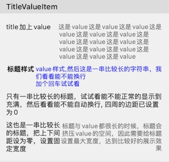

# TitleValueItem

文字展示单元格

可展示标题和value，同时提供自定义标题、value样式和位置等属性
 

## 属性

### 整体设置 (基类中已有属性未列出)

> **verticalAlignment**: 竖直方向排列方式
>
> **spaceBetweenTitleAndValue**: 标题与值之间的间距

### 标题(title)样式

> **title**：标题内容文字
> **attributeTitle**：富文本标题，如果设置了，则会替换掉title显示这个
> **titlePosition**：位置(自动宽度/固定宽度)
> **titleFont**：字体
> **titleColor**：字体颜色
> **titleAlignment**：对齐方式
> **titleLines**: 行数

### 值(value)样式

>**value**：值的内容文字
>**attributeValue**：富文本value，如果设置了，则会替换掉value显示这个
>**valueFont**：字体
>**valueColor**：字体颜色
>**valueLines**：行数
>**valueAlignment**：对齐方式

## 使用举例

```
Section("TitleValueItem") { section in
    section.contentInset = .init(top: 20, left: 16, bottom: 20, right: 16)
    section.lineSpace = 10
    section.column = 1
    section.header?.shouldSuspension = true
}
        <<< TitleValueItem("title加上value"){ item in
            item.verticalAlignment = .top
            item.spaceBetweenTitleAndValue = 8
            item.valueAlignment = .left
            item.value = "这是value这是value这是value这是value这是value这是value这是value这是value这是value这是value这是value这是value这是value这是value这是value"
        }
        <<< TitleValueItem("标题样式") { item in
            item.verticalAlignment = .top

            item.titlePosition = .left
            item.titleFont = UIFont.boldSystemFont(ofSize: 15)
            item.titleColor = .darkText
            item.titleAlignment = .center

            item.valueColor = .blue
            item.valueAlignment = .left
            item.value = "value样式,然后这是一串比较长的字符串，我们看看能不能换行\n加个回车试试看"
        }
    <<< TitleValueItem("只有一串比较长的标题，试试看能不能正常的显示到充满，然后看看能不能自动换行, 四周的边距已设置为0") { item in
        item.verticalAlignment = .top
        item.contentInsets = .zero
    }
    <<< TitleValueItem("这也是一串比较长的标题，把上下间距设为零，设置固定宽度",tag: "DEFAULT_LABEL") { item in
        item.value = "标题与value都很长的时候，标题会挤压value的空间，因此需要给标题设置最大宽度，达到比较好的展示效果"
        item.titlePosition = .width(120)
    }
```

