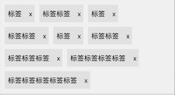
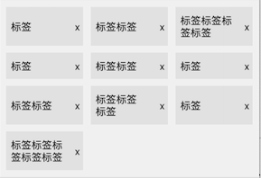

# QuickList

[简体中文|说明文档](./README_CN.md)

A framework for quickly creating CollectionView using Swift

## Requirements

- Xcode 16.0+
- Swift 5+

### Example App

You can clone this project and run the Example to see most of QuickList's features.

## Installation

QuickList supports [CocoaPods](https://cocoapods.org). Installation

QuickList project is divided into three subspecs:
> **Base**: Contains basic QuickList controls, predefined Layouts, Form, Section, Item, and operators
>
> **Items**: Contains some predefined Items
>
> **WebImage**: Contains predefined ImageItem and network image loading/caching logic extensions. This module depends on `Kingfisher` and `KingfisherWebP`, so it's separated as a standalone module

Add the following code to your project's Podfile:

```ruby
pod 'QuickList', :path => '../', :subspecs => ['Base', 'Items', 'WebImage']
```

> For convenient quick Item creation, some template files have been created in the xctemplate folder of the project. You can copy them to `/Applications/Xcode.app/Contents/Developer/Library/Xcode/Templates/File Templates/Source` folder, so you can directly select the corresponding Item type when creating files.
> Additionally, you can find the `CodeSnippets.zip` archive in the root directory of this project, which contains some predefined code snippets. You can extract it to the `~/Library/Developer/Xcode/UserData/CodeSnippets/` folder, and then you can view and use them in Xcode's `Code Snippets`.

## Operators

The framework defines some operators for quickly manipulating Form and Section, as follows:

| Operator | Description                                                   | Left Object          | Right Object                                                     |
| ------ | ------------------------------------------------------ | ----------------- | ------------------------------------------------------------ |
| `+++`    | Add Section or Item (automatically adds a Section when adding Item) | `Form`            | `Section` or `Item`                                         |
| `+++!`   | Add Section or Item, and update interface                   | `Form`          | `Section` or `Item`                                                  |
| `<<<`    | Add Item                                            | `Section`         | `Item`                                                    |
| `<<<!`   | Add Item or [Item], and update interface                        |  `Section`       | `Item` or `[Item]`                                      |
| +=     | Add all elements from the right object array                           | `Form` or `Section` | `[Section]` or `[Item]`                                     |
| `>>>`   | Replace all elements from the right object array to specified position | `Form` or `Section` | `>>>` has two usage methods:<br />1. Use `>>> [Section]` or `[Item]` to directly replace all elements in the original `Form` or `Section` with elements from the target array<br />2. Use `>>> (n ..< m, [Section] or [Item])` to replace the target array to a specified range (e.g., n ..< m represents all elements from n to m-1) |
| `>>>!` | Replace all elements from the right object array to specified position, and update interface   | `Form` or `Section` | Same usage as `>>>`                                             |
| `---` | Remove all elements, and update interface | `Form` or `Section` | None |

## Creating Lists

### Creating CollectionView

Use `QuickListView` to create lists, for example:

```swift
import QuickList

let listView = QuickListView()

listView.form +++ Section("Section")
```
QuickListView inherits from UICollectionView and adds the following properties and methods:

> **form**: The Form object bound to the list, used for handling data sets
> **scrollDirection**: Scroll direction, defaults to vertical scrolling
> **listSizeChangedBlock**: List total size change callback, suitable for cases where layout needs to be adjusted based on the actual size of displayed content
> **reload()**: Set to reload
> **selectItem(item:)**: Set to select the specified item (if the item's scrollToSelected is true, it will automatically scroll to the item's position)
> **setNeedUpdateLayout(afterSection:, animation:)**: Update layout with custom animations after specified section


## Layout Settings
The framework currently has the following predefined Layouts:

|     Name      |                             Description                             |                       Screenshot                        |
| :-----------: | :----------------------------------------------------------: | :-------------------------------------------------: |
|   QuickListFlowLayout   | Waterfall layout |    |
|   QuickYogaLayout   | Item flow arranged perpendicular to scroll direction, supports automatic line wrapping, suitable for tag-like display layouts |                  |
|   RowEqualHeightLayout   | Layout where all elements in a row use the maximum height of that row as the item height |               |

When using, you can set layout for the entire Form:
```
form.layout = QuickListFlowLayout()
```
You can also set layout for individual Section:
```
Section("Custom layout") { section in
    section.layout = QuickYogaLayout(alignment: .flexStart, lineAlignment: .flexStart)
}
```
The priority for custom layout is: section.layout -> form.layout -> QuickListFlowLayout (default)

## Data Operations

QuickList provides comprehensive data manipulation methods for both Form and Section levels.

### Section Operations
- **Animation Operations**: Insert, delete, and replace items with smooth animations
- **Basic Operations**: Standard array-like operations (append, insert, remove, etc.)
- **UI Control**: Optional UI updates for all operations

### Form Operations  
- **Animation Operations**: Replace and delete sections with animations
- **Basic Operations**: Standard collection operations for sections
- **Batch Updates**: Efficient batch operations with animation support

### Usage Examples
```swift
// Section operations
section.insertItem(with: newItem, at: 0, animation: .fade)
section.deleteItems(with: [item], animation: .leftSlide)
section.replaceItems(with: newItems, inAnimation: .fade, outAnimation: .scale)

// Form operations
form.replaceSections(with: newSections, inAnimation: .fade, outAnimation: .scale)
form.deleteSections(with: [section], inAnimation: .leftSlide, outAnimation: .rightSlide)
```

## Usage Instructions

[Form](./Doc/Form的使用.md)

[Section](./Doc/Section的使用.md)

[Item](./Doc/Item的使用.md)

[List Reload Animation](./Doc/ListReloadAnimation.md)

---
## Feature Plans
#### Inline Cells (InlineItem)
Associate two items with each other, making one serve as an inline cell for the other. Click the main cell to expand/collapse the inline cell
(To be developed)

#### Item Dragging
Support drag animation interaction functionality for items
(To be developed)

#### Left (Right) Swipe Expand Buttons
Support side swipe expand button list functionality similar to tableView
(To be developed)

#### SegmentPage
A pageController created based on QuickList that can be embedded in Lists
[Usage Documentation](./Doc/SegmentPage的使用.md)

#### Picker
A PickerView created based on QuickList
(To be developed)

#### SwiftUI Support
(To be developed)

---

## Author

Guo ZhongCheng, gzhongcheng@qq.com

## License

QuickList is available under the MIT license. See the LICENSE file for more info.